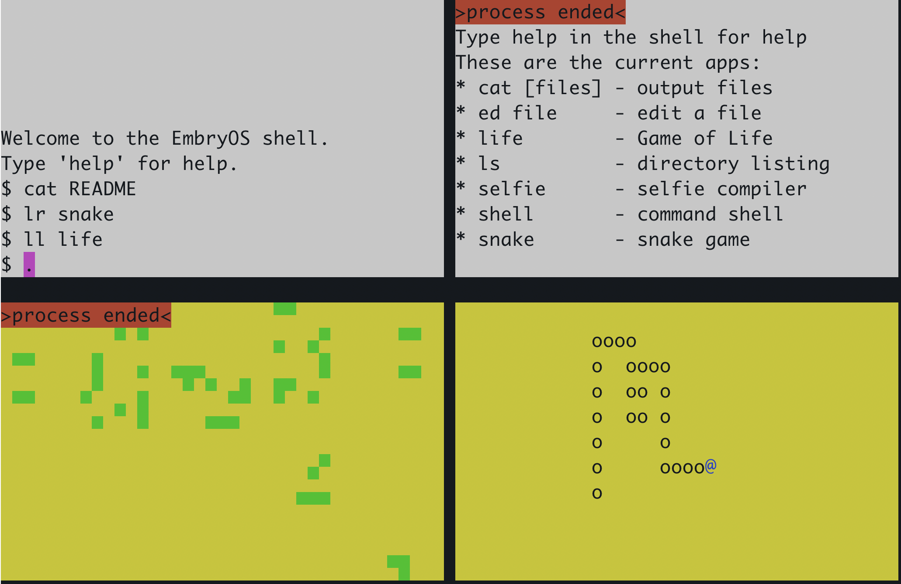

# EmbryOS
*A tiny RISC-V operating system you build from scratch, one chapter at a time.*

EmbryOS is an educational operating system that grows from a machine that does nothing to a complete multicore operating system with virtual memory, user processes, a file system, and interactive applications — all running on real RISC-V hardware.

Every chapter in this repository is a **working OS snapshot**, and every step is small enough to understand. You don’t just read about operating systems — you *build* one.

## Demo Screenshot

<p align="center">
  
</p>

This shows the screen of EmbryOS, with a shell running in the top left window,
the output of `cat README` in the top right window, the game `snake`
running in the bottom right window, and the final output of an instance of
`Conway's Game of Life` in the bottom left window.

## What This Repository Contains

The repository is organized into incremental **chapters**, each representing a runnable version of the OS:

- Each chapter adds a small number of source files and modifies existing ones.
- Every chapter is self-contained and boots on its own.
- Scripts such as `ediff.py` let you view differences between chapters.

## The EmbryOS Philosophy

EmbryOS grows layer by layer, introducing one concept at a time:

- Chapter 01: Hello World
- Chapter 02: Console output
- Chapter 03: Context switching
- Chapter 04: Timer-based preemption
- Chapter 05: Console input
- Chapter 06: Virtual memory and system calls
- Chapter 07: Shell
- Chapter 08: Block devices
- Chapter 09: File system
- Chapter 10: Directories
- Chapter 11: Multi-core support
- Chapter 12: Fancy apps (editor, compiler)

## Who EmbryOS Is For

- Students
- Educators
- Hobbyists
- Anyone curious about operating systems

Requires basic C and comfort with the command line.

## Requirements

- A RISC-V compiler and QEMU (or use Docker -- see below)
- Optional: real hardware (VisionFive2, Orange Pi, Banana Pi, more coming)

## Why C Instead of Rust

- C exposes the machine directly
- Rust introduces a second curriculum (lifetimes, borrowing, etc.)
- EmbryOS is a small, controlled teaching OS where C is ideal

## Quick Start
First clone the repo:
```
git clone https://github.com/rvanren/EmbryOS.git
cd EmbryOS
```
If you do not have the GNU RISC-V toolchain and QEMU already installed in your
environment, you may want to use `docker` to set up your environment:
```
docker build --no-cache -t embryos .
docker run -it -v `pwd`:/embryos --rm embryos
```
(You may have to update `Dockerfile` to match your environment.)

Then (in either case):
```
cd chapter01
make qemu
```
(To get out of QEMU, enter cntl-A x)

There is also a high fidelity logging system that captures most events
that happen in the kernel.  See the log folder.

## 📄 License

Not yet
